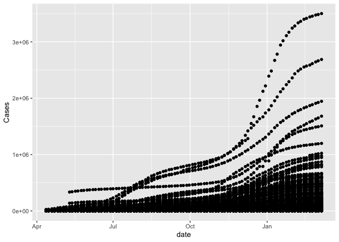
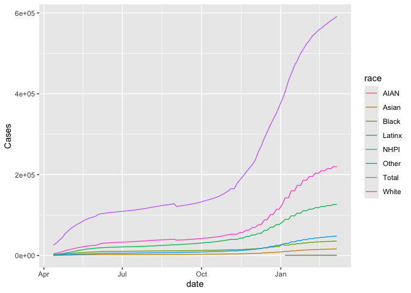

# Week 02: COVID Visualization Activity
**`[[`**Your Name**`]]`**
2023-09-11

Today, we’ll be working with a data set related to COVID. This data is
based on data from the the [COVID Tracking
Project](https://covidtracking.com/). I cleaned up this data and also
added total populations from the 2020 for each of the relevant
categories. Note, due to differences in the way race and ethnicity are
encoded in the census as compared to the the COVID Tracking Project, the
population counts for LatinX may be somewhat inaccurate.

``` r
library(tidyverse)
```

    ── Attaching core tidyverse packages ──────────────────────── tidyverse 2.0.0 ──
    ✔ dplyr     1.1.4     ✔ readr     2.1.5
    ✔ forcats   1.0.0     ✔ stringr   1.5.1
    ✔ ggplot2   3.5.1     ✔ tibble    3.2.1
    ✔ lubridate 1.9.3     ✔ tidyr     1.3.1
    ✔ purrr     1.0.2     
    ── Conflicts ────────────────────────────────────────── tidyverse_conflicts() ──
    ✖ dplyr::filter() masks stats::filter()
    ✖ dplyr::lag()    masks stats::lag()
    ℹ Use the conflicted package (<http://conflicted.r-lib.org/>) to force all conflicts to become errors

``` r
load("CRDT Data.RData")
ls()
```

    [1] "covid_data_count"  "covid_data_long"   "covid_data_orig"  
    [4] "covid_data_race"   "covid_data_simple"

I’ve include 4 different data sets. They all have the same data but have
it represented in different ways. Try using the different data sets and
see which ones are good for making which plots.

``` r
ggplot(covid_data_count, aes(x = date, y = Cases)) + geom_point()
```

    Warning: Removed 1385 rows containing missing values or values outside the scale range
    (`geom_point()`).



If you want to only look at a specific state, you can do it like this.
For now, see what you can do just using `ggplot`.

``` r
covid_data_count |> 
  filter(state == "MA") |> 
  ggplot(aes(x = date, y = Cases, color = race)) + geom_line()
```



1.  After making and refining some plots, pick one and save the code and
    describe what you observe?
2.  What conclusions can you draw?
3.  What were you not able to do due to not having the coding knowledge?
4.  What made previous plots you made hard to interpret/understand? What
    did you do to improve/change them to ease interpretation?
5.  What other data would be useful to better understand this data?
